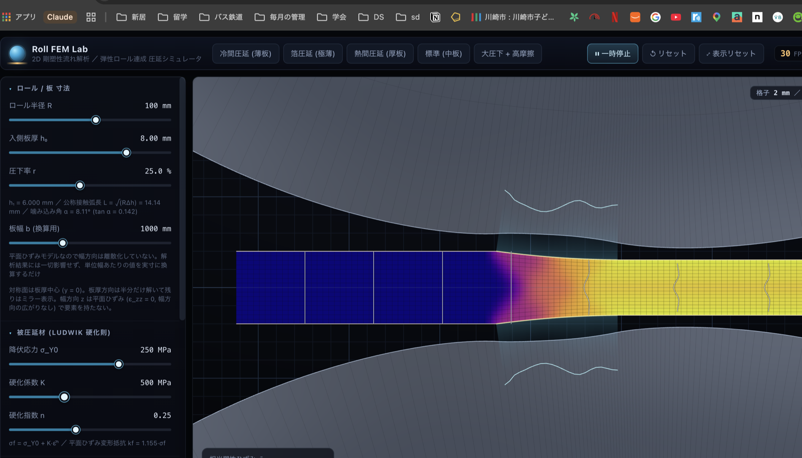

# Roll FEM Lab — 金属圧延の剛塑性 FEM シミュレータ

ブラウザ上で動く 2 次元の圧延（rolling）解析アプリ。被圧延材の**塑性変形**と作業ロールの
**弾性変形（扁平）**を連成して解き、圧延荷重・トルク・摩擦丘・中立点・前方すべりを
リアルタイムに可視化する。オープンソースのみで構成（TypeScript + Vite + WebGL2、外部数値ライブラリなし）。



## 何を解いているか

### モデル化の範囲（重要）

| 方向 | 扱い |
|---|---|
| 圧延方向 x | 全域（入側の剛体域 → ビット → 出側） |
| **板厚方向 y** | **半分だけ解く**。`y = 0` が板厚中心の対称面で `v_y = 0` を拘束。画面で全厚に見えるのは描画上のミラー |
| **板幅方向 z** | **要素を持たない**。平面ひずみ (`ε_zz = 0`) — 幅は無限大とみなし、幅方向の広がり (spread) は生じない |
| ロール | 上ロールのみ解く。下ロールは描画ミラー（ミラー変換が回転の向きも反転させるので自動的に逆回転） |
| 温度 | 「加工発熱」は既定 ON（OFF で等温）。ON のとき塑性仕事を熱源として**断熱**で温度を運ぶ（熱伝導・ロールへの抜熱なし、§1b） |

「半分」は**板幅ではなく板厚**。幅方向は半分ですらなく、まったく離散化していない。

したがって出力はすべて**単位幅あたり**（`kN/mm`, `kN·m/m`, `kW/m`）。実機値は板幅を掛ける。
UI の「板幅 b (ライン共通)」は解析に一切影響せず、総圧延荷重 [MN / tonf]・総トルク・総動力
（上下 2 本分）に換算して表示するだけ（既定 1300 mm）。

例: 圧延荷重 9.27 kN/mm × 板幅 1200 mm = 11.1 MN ≈ 1130 tonf。

この仮定が効かなくなるのは幅/厚 比が小さいとき（棒鋼・角材に近い断面）。板圧延では
幅/厚 が数十〜数百なので平面ひずみは良い近似だが、ロールのたわみ・クラウンによる
幅方向の板厚分布は原理的に扱えない。

### 1. 被圧延材 — 剛塑性 流れ定式化 (`src/sim/flow.ts`)

金属成形 FEM の標準手法である flow formulation（Kobayashi / Oh / Altan）。弾性ひずみを無視して
非圧縮の剛塑性連続体とみなし、変位履歴ではなく**定常速度場**を未知数にする。Markov の変分原理

```
Π(v) = ∫ σf · ε̄̇(v) dV + (K/2)∫ (div v)² dV − ∫ t·v dS
```

を停留させる。前反復の実効粘度

```
μ_eff = σf / (3·√(ε̄̇² + ε̇₀²))
```

を凍結すると各反復が線形 Stokes 型問題になる（Picard 反復）。時間積分も接触探索も不要なのが、
これがリアルタイムで回る理由。正則化 ε̇₀ はニップ前後の剛体域で粘度を有限に保つ。

- 要素: Q4、偏差項 2×2 Gauss、体積項は重心 1 点（選択的低減積分＝体積ロック対策）
- 変形抵抗: **LMN 式** `kf = L·(ε̄ + M)^N`（`solver.ts` の `planeStrain`）。L は係数 [MPa]、
  M は予ひずみ、N は硬化指数で、冷延材の実測 kf 曲線がこの 3 つで与えられることが多い。
  LMN が返すのは**平面ひずみ変形抵抗 kf** なので、流れ定式化が使う単軸相当応力は
  `σf = (√3/2)·kf`（`uniaxial`）。荷重式が要るひずみ平均 kf は解析積分してある
  （`meanPlaneStrainLmn`）。3 つの指数は読み取りにくいので、UI では代わりに
  `kf(0)` / `kf(ε̄=0.2)` / 出側 `kf` を MPa で出す。
- 相当ひずみは流線に沿って上流側へ後退追跡して輸送（構造格子の列スイープ）
- **段間の受け渡し**: 板が運ぶ量は板厚だけではない。タンデムの各スタンド / リバースの各パスは、
  前段の**出側ひずみ・出側温度**をそのまま入側条件として受け取る（`Mill.advance`）。
  冷間で 25% 圧下すると kf は 371 → 869 MPa まで上がるので、下流段に未加工材を渡すと
  変形抵抗を半分以下に見積もることになる。実際 3 スタンド（各段 25% 指令、700 tonf 一定）で
  #3 の荷重は **438 → 637 tonf** と 45% 増える。ミルライン図の `kf 入/均/出` を横に読むと、
  ある段の「出」が次の段の「入」に一致していることが確認できる

### 1b. 加工発熱と熱軟化 (`heatOn`)

**既定 OFF。** ON にすると、板が圧延中に自分で出した熱の分だけ変形抵抗が下がる。

**熱源** — 塑性仕事率 `σf·ε̄̇` [W/m³] のうち β（テイラー・クイニー係数、金属で 0.85〜0.95）が熱に
なる。残りは転位として組織に貯まる分。

**断熱とみなす根拠** — ビット通過時間は 2 mm 材で 1 ms 程度。その間に熱が拡散する距離は
`√(αt) ≈ √(1.2e-5 × 1e-3) ≈ 0.11 mm` で、板厚に対して十分小さい。だから各粒子は自分で出した
熱を持ったまま出ていくとみなし、**温度をひずみと同じ流線に沿って輸送する**（同じ後退追跡の
列スイープを使うので追加コストはほぼゼロ）:

```
T(x) = T_up + β·σf·ε̄̇·Δt / (ρc)
```

**熱軟化** — Johnson-Cook の熱項を等温 kf に掛ける:

```
kf(ε̄, T) = L·(ε̄ + M)^N · (1 − T*^m),   T* = (T − T₀)/(T_m − T₀)
```

基準点が室温ではなく**入側温度 T₀** なのが要点で、これにより

- 軟化率は入側で定義上ちょうど 0。このモードが見せるのは**そのパスが自分で作った軟化だけ**
- 等温解との A/B が成立する（OFF と ON で他は何も変えていない）
- 熱間の入側 1000 °C が、誰も入力していない係数で最初から軟化した状態にならない

数値的な下限として係数は 0.05 で床止めしてある。剛粘塑性の解は変形抵抗がゼロに近づくと
剛性を失って速度場が定義できなくなるため。

**実測（このアプリ上）**

| | 冷間 (h₀ 2 mm, 20.9%) | 熱間プリセット (h₀ 20 mm, 29.6%, 入側 1000 °C) |
|---|---|---|
| 塑性仕事 | 227 MJ/m³ | 88 MJ/m³ |
| 出側温度上昇 ΔT | **+45.6 K** (20 → 65.6 °C) | **+18.0 K** (1000 → 1018 °C) |
| 出側 軟化率 | 3.08 % | **3.61 %** |
| 出側 kf | 888 → 861 MPa | 226 → 218 MPa |
| 圧延荷重 | 7.274 → 7.143 kN/mm (−1.8%) | 7.422 → 7.245 kN/mm (−2.4%) |

冷間鋼板の 40〜50 K という上昇量は実機で測られている値と合う。熱間は温度上昇こそ 1/2.5 だが、
融点までの余裕 `T_m − T₀` が 500 K しかないので**軟化率はむしろ冷間より大きい** — 同じ ΔT が
どれだけ効くかは絶対温度ではなく相同温度で決まる、という熱項の性質がそのまま出ている。

**段間の受け渡し** — 温度もひずみと同じく次段に引き継ぐ。3 スタンドで各段 20 K 前後ずつ
積み上がるので、冷間 3 スタンドの実測は 20 → 65 → 135 → 209 °C。スタンド間の空冷は
入れていない（通過時間と熱伝達係数を持っていないため）ので、ライン全体を断熱で読んだ値。

**入れていないもの** — ロールへの抜熱（ロール冷却・接触伝熱）、板内の熱伝導、スタンド間の空冷。
いずれも温度を下げる向きなので、ここで出る ΔT は**上限側の見積り**。板厚方向の温度分布も、
断熱ゆえひずみ分布をなぞるだけで、表層冷却による実機の分布とは違う。

### 2. 作業ロール — 線形弾性 FEM (`src/sim/mesh.ts`, `solver.ts`)

剛体芯金の上に載る弾性円環。界面トラクションを荷重として静的に解き、扁平した胴面プロファイルが
次フレームのロールギャップになる。これが**ロール扁平**そのもの — 冷間圧延で公称半径 R ではなく
変形半径 R' を使う理由であり、薄板ほど圧下しにくくなる理由。

ロールメッシュは**空間固定（Euler 枠）**。均質等方の円環は回転に対して不変なので弾性場は
実験室系で定常であり、輸送すべき履歴がない。固定すると周方向メッシュをニップに集中でき、
これが効く: 接触弧は円周のわずか数 % しかないため、回転する一様メッシュでは接触弧に数節点しか
乗らないが、集中させると同じ節点数で数十節点乗る。回転は摩擦の表面速度と表面マーキングの位相で表現。

### 3. 入出側の弾性域 (`elasticZones`)

剛塑性の仮定はビットの中では良いが、入口と出口ではそのままだと板が完全剛体になる。実際は

- **入側**: 降伏する前に弾性圧縮される（`Δh_e = h₀·kf/E′`）
- **出側**: ロールを出た瞬間に弾性回復する（スプリングバック `≈ kf/E′`、板厚の 0.3% 前後）

そこで粘度の上限を、材料自身の弾性応答をビット通過時間 `t` にわたって効かせた値 `G·t` に置き換え、
体積項も真の体積弾性率 `K·t` にする。ビットの中にいる材料は自分の弾性剛性より硬くはなれない、
という上限で、従来の「muRef の 150 倍」という恣意的なクランプを物理量に置き換えたもの
（実測すると両者は 218〜279 倍で同程度だった）。

出側スプリングバックは FEM が出した出口の応力状態から

```
Δε_yy = (1−ν²)/E · [ p − ν/(1−ν)·(σ_front − σ_xx) ]
```

で求め、出側の形状（x > 0 の板厚）に反映する。板厚が実際に増えるので質量収支・出側速度にも効く。
`docs/validation.md` に理論との照合がある。

### 4. 自由表面（接触弧の外）

メッシュはロールギャップに沿って作られ、板の上面は接触弧の上ではロール表面そのものだが、
**弧の外は自由表面**になる。定常状態では自由表面 y = s(x) は流線なので

```
v · n_s = 0,    n_s ∝ (−s′, 1)
```

が成り立たなければならない。入側は平坦（s′ = 0）なので、これは単に v_y = 0。

この条件が無いと、材料が固定メッシュの上面を突き抜ける。入側の助走区間は剛体ではなく
「粘度に上限を付けた非常に硬い流体」でしかないので、ビットが押し返す圧力の下で上へ逃げる。
実測した漏れ量（上面の v_y / v_x、入側平坦部）と、入口から出口までの流量比:

| 指令圧下率 | 上面 v_y/v_x | 出口/入口 流量比（条件なし） | 同（条件あり） |
|---|---|---|---|
| 25% | −2.6e-6 | 1.002 | 1.005 |
| 70% | +2.2e-3 | 0.988 | 1.015 |
| 93% | **+4.5e-2** | **0.486** | **0.940** |

93% 圧下では**入ってきた材料の半分がロールに届く前に消えていた**。しかも損失は接触弧の
手前で起きており、ビット内の流量はほとんど変わらない — つまり局所的な非圧縮（div v は
5e-4 程度）は効いているのに、境界条件が欠けているせいで大域的な質量が保存しない、という
状態だった。

条件は接触弧の**外側だけ**に課す。接触被覆で按分して弧の内側にも弱く効かせると、部分被覆の
節点がロール拘束と自由表面拘束を同時に受けてビット入口が固定され、先進率が全条件で −53%
という無意味な値になる。

### 5. 界面

メッシュがロールギャップに適合しているので接触は境界条件になる（接触探索なし）。

- 法線: `v·n = 0` をペナルティで拘束
- 摩擦: 正則化 Coulomb `τ = −μ·p·(2/π)·atan(Δv/v₀)`、割線接線を接線剛性に加えて反復を縮小写像に保つ
- 中立点はせん断の符号が変わる位置（板とロールが同速で走る点）

### 6. 先進率・後進率

- **先進率** `f = (v₁ − v_R)/v_R` — 出側の板がロール周速をどれだけ追い越すか
- **後進率** `b = (v_R − v₀)/v_R` — 入側の板がロール周速からどれだけ遅れているか

体積一定から `b = 1 − (1+f)(1−r)` なので、後進率はほぼ圧下率に等しくなる。

中立点から求まる理論値 `f = x_n²/(R′h₁)` も並べて表示している。これは板厚方向に速度一様
（平面保持）を仮定して板の *平均* 速度をロール周速に等しく置いた式だが、FEM の中立点は板 *表面*
の速度で判定している。表面は摩擦に引かれて平均より遅れるので両者は一致せず、摩擦が強いほど差が
縮む（μ=0.10 で 0.59% 対 0.07%、μ=0.30 で 5.71% 対 4.15%）。

### 7. 送り速度の自走制御

入側面の速度を拘束すると、摩擦で供給しきれない長手方向の力が反力として現れる。実機の圧延機には
押す相手がいないので、この反力が 0 になるまで送り速度を制御する。結果として**前方すべり**が
出力として得られる。

### 8. 自動板厚制御 (AGC) / 定圧延荷重制御

スクリューが決めるのは**無負荷**のロールギャップ S であって、出てくる板厚ではない。荷重で
ロールが扁平し、出側で板が弾性回復する分（**ミルスプリング**）だけ実際の出側板厚は S より厚く
なる。スクリューを指令圧下率のまま止めておく限り、実圧下率は必ず指令値を下回る — これが
「圧下達成率」が 1 を割る理由で、数値的な破綻ではない。

実機は測定値のまわりでループを閉じてこれを解決する。本シミュレータも同じで、`agcMode` で 4 つ
から選ぶ。

| モード | 表示名 | 制御量 | 目標 | 圧下率指令の意味 |
|---|---|---|---|---|
| `off` | なし | — | — | ギャップ指令 S = h₀(1−r) をそのまま保持 |
| `ratio` | 圧下率一定 | 出側板厚 h₁ の実測値 | **h₀(1−r)** | 目標そのもの。収束すると圧下達成率が 1.000 |
| `gauge` | 出側板厚一定 | 出側板厚 h₁ の実測値 | **絶対値 h₁\*** | 解析窓のサイズ決めのみ。圧下率は結果 |
| `force` | 荷重一定 | 圧延荷重 P | 目標圧延荷重 P\* | 同上 |

#### 圧下率一定と出側板厚一定の違い

**同じコントローラで、目標の出どころだけが違う。** `ratio` の目標は自分の入側板厚に紐づいた
`h₀(1−r)` で、`gauge` の目標は入側と無関係の絶対値。この 1 点が外乱に対する挙動を分ける。

入側板厚を 2.00 → 2.20 mm（+10%）に振ったときの実測:

| モード | 出側板厚 | 圧下率 |
|---|---|---|
| 圧下率一定 | 1.4998 → **1.6461 mm** | 25.01% を保持 |
| 出側板厚一定 | 1.4998 → **1.4999 mm** を保持 | 25.01 → 31.67% に追随 |

**圧下率一定は変動を下流へ渡し、出側板厚一定は自分で吸収して切る。** コイルは圧下率ではなく
板厚で売るので、実機のタンデムラインは最終スタンドを出側板厚一定にする。3 スタンドで
#3 のみ出側板厚一定にし、#1 の圧下率指令を 25 → 18% に振った実測:

```
        変更前                    変更後
#1  25.01%  1.4998 mm    →    18.01%  1.6399 mm   ← 変動を発生
#2  25.00%  1.1249 mm    →    25.00%  1.2299 mm   ← そのまま通過
#3  18.26%  0.9194 mm    →    25.35%  0.9182 mm   ← 圧下率で吸収、板厚は −0.13%
```

モードを出側板厚一定に切り替えた時点の実測板厚がそのまま目標として引き継がれる。
操作者が選んだのはモードであって設定値ではないので、切替それ自体でステップ入力を
与えてはならない。

#### ミルスプリングを補正するか（`agcSpringComp`）

「圧下率は入力なのだから目標圧下率で 1 回計算すれば終わるのでは」— その計算はできる。
AGC パネルの **ミルスプリングを補正する** を OFF にすると、圧下率一定・出側板厚一定は目標を
**スクリュー位置そのもの**として 1 回置くだけになる（S = h₀(1−r) または目標板厚）。ループは回らず、
出側板厚は S ＋ ミルスプリングになり、その差が「偏差」欄と状態欄に出る。

3 スタンド・圧下率 25% 指令・既定条件の実測:

```
                ON（既定・補正あり）                    OFF（補正なし・1 回置き）
 std   S[mm]    h₁[mm]   h₁−S[µm]  P[tonf]     S[mm]    h₁[mm]   h₁−S[µm]  偏差    P[tonf]
 #1    1.4001   1.5000    99.9     1141        1.5000   1.5881    88.1    +4.4%    987
 #2    1.0141   1.1250   110.9     1313        1.1911   1.2856    94.5    +5.9%   1046
 #3    0.7339   0.8437   109.8     1340        0.9642   1.0563    92.1    +7.2%   1084
```

ON は実測出側板厚が目標に一致するまで締める（そのぶん S は指令より 100 µm ほど下がり、
整定に 10〜20 s）。OFF は S が指令そのもので即座に決まるが、板は 88〜95 µm 厚く出て、
タンデムでは下流の入側もそのぶん厚くなる（#2 の h₀ が 1.5000 でなく 1.5881）ので偏差が
段を追って積み上がる。荷重一定には効かない（荷重ループに補正する板厚がない）。
スプリング**そのもの**を消したいなら「ミル弾性」のロール弾性連成・ミル剛性・
「入出側の弾性変形」を切る — こちらは物理の ON/OFF、この項目は制御の ON/OFF。

#### 不感帯は 1e-6 が既定（旧 1e-4）

ループは偏差が**初めて不感帯に入った瞬間に止まる**ので、残る誤差は帯の中のどこか — つまり
不感帯の値がそのまま結果の精度になる。旧既定 1e-4 では 6 ケースの残差が 1.8e-3〜9.8e-3 % に
ばらついていた。止めたループの周りでプラントが揺れる量は板厚制御で 1.9e-8 %、荷重制御でも
4e-4 % と帯の 25〜500,000 倍下にあり、締めても失うものは整定時間だけ:

```
                       1e-4（旧）           1e-6（新既定）        1e-7
 圧下率 25→35 %        7.6 s / 8.0e-3 %    10.0 s / 8.4e-5 %    12.8 s / 5.1e-6 %
 板厚 1.50→1.30 mm     8.7 s / 1.8e-3 %     9.8 s / 7.2e-5 %    12.4 s / 7.5e-6 %
 荷重 900→1300 tonf   12.8 s / 7.9e-3 %    21.4 s / 9.1e-5 %    25.7 s / 1.5e-7 %
```

壁は 1e-8（荷重制御が 60 s で帯の 2 倍手前に止まる）。スライダは 1e-8 まで下げられる。
測定値の平滑を長くする案・自走速度の刻みを適応させる案は、どちらも実測で負けたので入れていない
（`docs/validation.md`）。

#### 収束の解除帯は 1e-4（不感帯とは別）

不感帯は「そこまで追い込む精度」、解除帯は「そこに居続けたと見なす幅」。両方を同じ数にはできない。
スクリューを止めてもプラントは動く — 自走速度ループは自分の残差が不感帯をまたぐたびに速度を
刻み、そのたびに出側板厚が 0.1 µm 動く。荷重制御ではそれがスラブ式で増幅されて荷重の 2e-5、
不感帯の 20 倍になる。実測（3 スタンド荷重一定 1040 tonf・スラブ法）では #2・#3 が 1040.0 に
届いたあと「収束」と「調整中」を永久に往復し、そのたびにスクリューを数十 nm 動かして何も
達成していなかった。今は一度不感帯に入ったら偏差が 1e-4（h₀ 比 / 目標荷重比）を超えるまで
収束扱い — 実際の外乱（前段の再目標、目標変更）は帯を素通りし、ジッタは超えない。
この解除帯を出た瞬間が新しい収束の始まりで、ミルライン図の「収束 反復」はそこから数え直す。

#### 板メッシュは噛み込み入口に列を追従させる（接触列の出入りは起きない）

板メッシュの列は圧延方向に等間隔ではない。毎フレーム、**噛み込み入口にちょうど 1 列、出側平面
x = 0 にちょうど 1 列**が乗るように列位置を引き伸ばして配置し、その間の列が接触集合になる。
接触集合は固定で、列が入ったり抜けたりすることが構造的に無い。

以前は等間隔メッシュで、入口が列境界に乗ると「列が接触に入る → 荷重が上がる → 扁平でロールが
h₀/2 より浮いて列が抜ける → 荷重が下がる → また入る」を制御ループの外で繰り返した（既定 100×8・
gap 1.5606 mm で 853↔944 tonf、接触 19↔20 列、永久）。荷重一定ではこの ±5% の段の中に目標が
入ると原理的に収束できず、3 スタンド 1040 tonf が全段「内側ループ待ち」のまま ±3.5% で
ハンチングしていた。メッシュ細分は段の位置を変えるだけで消さず、組み立てを入口位置で連続に
する 2 案（摩擦の被覆率重み・拘束法線のブレンド）は検証済みの数値を壊した。列を動かすのが、
組み立てに手を付けない唯一の解だった。

入口の列は接触集合に入り、その拘束は「ロール半径方向」ではなく**両隣の面の平均勾配に沿う
流線条件**（摩擦は自分の負担長の半分ぶん）。入口節点を半径方向に拘束すると、まだ水平な上流側の
面を横切って材料が下向きに送られ、板上面から流量の 1.1% が湧き出し、入口に圧力スパイクが
立った — 荷重が「入口列がどこに居るか」の急な関数（約 700 tonf/mm）になり、メッシュが交点を
追い、荷重がメッシュを追い、バレルが荷重を追って、静かな立ち上がりから 340↔1600 tonf の
発振に育った。

入口列を交点に**いつ**動かすかは別の問題で、答えは「制御ループが働いている間は動かさない」。
交点を毎フレーム追わせても、ゆっくり緩和させても、速度ループが静かなときに小刻みに動かしても、
スクリュー移動に合わせて幾何で先回りさせても、3 スタンドの最終段では自走速度ループが鳴った
（h₁ ±0.3 µm・荷重 ±1%・周期 6 s）。入口を固定すれば同じスタンドが 61 s で整定し末桁まで静止する。
そこで入口列は、**スタンドが静か（速度ループが帯の中・ギャップループが収束か制御なし）な
フレームにだけ**交点へ置き直し、その後 1 s は動かさない（外側反復）。1 回の置き直しは荷重の
最大 0.25%、交点の跳ね返りはその 0.13 倍なので数回で収まる。交点から 0.05 列以上離れたときだけ
（配置直後・目標の大変更）無条件に追う。板表面が読む列ごとのバレル高さは、ロール変位の緩和の
上にもう一段の低域通過を持つ — これが扁平ループの減衰で、外すと入出側弾性 OFF（体積ペナルティが
20 倍硬い）で荷重 ↔ 扁平が 450 ↔ 4500 tonf を往復する。列が動いたときは旧位置から補間して引き継ぐ。
数値は `docs/validation.md` — 既定運転点の荷重は 987 → 959 tonf（質量収支 1.0154 → 0.9962、
以前の +1.5% は入口の湧き出しだった）。

**荷重一定 × FEM 荷重の収束は ±0.25% まで。** FEM 荷重は接触弧を 1 列あたり約 5% で読み、
その弧は上記の通り最大 0.05 列刻みでしか直らない。その下では荷重はスクリューの関数として
ループが同定できるものではなく（弧が固定のまま同定したゲインは弧の項を欠き、置き直しは自分が
起こしていない跳びとして見える）、1e-6 を要求すると ±0.5% で永久にハンチングした。荷重一定で
FEM 荷重のときは不感帯を `max(設定値, 2.5e-3)` とし、制御状態に「収束（FEM 荷重のメッシュ分解能
±0.25% 内）」と出る。メッシュ 100×8 と 200×14 の荷重差 0.8% の内側であり、これ以上は
メッシュの分解能そのもの。スラブ法の荷重は出側板厚だけの関数なので設定した不感帯のまま。

#### 目標が入側板厚以上のときは保留

出側板厚一定で、目標がそのスタンドの入側板厚以上になることがある。タンデムで最終スタンドを
1.5 mm に固定したまま上流を緩め、上流が既に 1.5 mm を出すようになった場合など。このとき
スタンドは**圧延するものが無い**。

判定は単純で、**丸める前の目標 ≥ 入側板厚の現在値**（#1 はライン入側、2 段目以降は前スタンドの
出側の現在値）。該当するスタンドは計算を保留し、板が入側板厚のまま素通りしたものとして扱う
（荷重 0、トルク 0、圧下率 0）。速度場・ひずみ・扁平は保持したままなので、目標を入側より
薄くすれば即座に復帰する。ミルライン図には「保留（目標 ≥ 入側）」、AGC パネルには
「保留（目標 2.0020 ≥ 入側 2.0000 mm）」と比べた 2 つの数字をそのまま出す。

> 以前は床を「入側 − 最後に測ったミルスプリング」にしていた。スタンドは自分の入側までは
> 圧延できない、という理屈だが、スプリングは荷重の関数で軽圧下では小さくなるので、重い圧下で
> 測ったスプリングを軽い圧下に当てるのは過大 — スキンパス（1〜3%）を丸ごと保留にしていた。
> 「メッシュで解ける最小圧下量」を床にする案も試したが、実際の数値限界（接触 5 列前後）は
> メッシュ・ロール径・板厚で動き、通した目標に届かないケースが出た。
> 入側より薄いが軽すぎて解けない目標は保留の対象ではなく、下の「噛み込みが浅すぎる」で報告する。

##### 入側より薄いが軽すぎる目標 — 「噛み込みが浅すぎて解けない」

既定メッシュ（板 100×8）での実測（単スタンド、h₀ 2.0 mm、出側板厚一定）:

```
 圧下率   接触列   整定
 3%        8      33 s で収束
 1%        6      収束しない（h₁ 1.9736 で停止、内側ループ待ちのまま）
 0.5%      5      収束しない
 0.1%      5      収束しない
```

接触弧が 5〜7 列にしか乗らないと自走速度ループが収まらず、ギャップループは動けない。
この状態は「内側ループ待ち」ではなく**「噛み込みが浅すぎて解けない（圧下 X%・接触 N 列）」**と
表示し、メッシュ品質を上げるか圧下量を増やすよう促す（判定は目標圧下率 < 2% かつ停止中。
接触列数で判定すると同じ 1% 目標が 6 列で止まったり 7 列で止まったりして取りこぼす）。

目標荷重は**総荷重 tonf** で与える（実機のロードセルが読む量）。解析は平面ひずみなので
ソルバが制御するのは単位幅あたりの荷重 `agcTargetForce` [N/m] で、両者は板幅 b で結ばれる:

```
agcTargetForce [N/m] = P* [tonf] × 9806.65 / b [m]
```

したがって**定圧延荷重制御では板幅 b が解析に効く**。他のモードでは b は表示換算専用で
結果に影響しない。

ミルスプリングは消せないので、AGC は**あらかじめ余分に締めて相殺する**。h₀ = 2 mm を 25% 圧下
する冷間条件なら、S を 1.500 mm ではなく 1.430 mm に置くことで h₁ = 1.500 mm が出てくる。

#### ループの作り

制御対象のゲインはミル自身の

```
dh₁/dS = M / (M + Q)        M: ミル剛性 (ロール扁平)、Q: 塑性曲線の勾配
```

で、1 をかなり下回るうえ板厚・ロール径・摩擦・硬化に依存する。そこで値を仮定せず、**直前の
移動から実測して逆数を掛ける**（減衰付きセカント法＝ニュートン法）。安定化のために 4 つ:

- 測定値を一次遅れで平滑化する
- スクリューは数フレームに 1 回しか動かさない（扁平ループが緩和する時間を与える）
- 不感帯を持ち、自分のノイズを追いかけ始める前に止まる
- 1 回の移動量と同定感度の範囲をクランプする

最後のクランプが効く。ステップは `誤差 / 感度` なので、感度を 0 付近で同定すると移動量が発散
する。しかもこの離散化では**荷重はギャップの滑らかな関数ではない** — 胴面が動くと接触集合が
要素 1 列単位で増減するので階段状になる。感度を 0 から遠ざけてクランプすることが、この階段で
スクリューが吹き飛ぶのを防いでいる。

スクリューの可動域は `[0.02·h₀, 0.98·h₀]`（下端は左パネル「スクリュー下限」、既定 2%）。
かつては 30% で、その先は質量収支が崩れるという理由だったが、現在の解では 86% 圧下まで
±2.6% 以内に収まるので（`docs/validation.md`）、壁ではなく**質量収支の警告**（3% で注意、6% で崩れ、
右パネル・スタンド表・ミルライン図見出しに出る）で妥当性を示す形に変えた。
ただし**開く側の本当の限界はスクリュー位置では
決まらない** — h₀ の中に収まっていなければならないのは負荷時の板厚、すなわち
「ギャップ ＋ ミルスプリング」のほうで、レールに届く手前で板が素通りしはじめる。そこで開く側は
実測スプリングを引いた `0.995·h₀ − ミルスプリング` でも頭打ちにしてある。接触弧が 1 点に潰れると
流れ解析の足場が消えるので、これは必須。目標が可動域外なら「ギャップ端に張り付き」と表示する。

測定条件 (h₀ = 8 mm, R = 100 mm, μ = 0.10 — いずれも測定当時の既定) で到達できる荷重は **235〜1682 tonf**（板幅 1 m 換算）。
下端は S = 0.98·h₀ で実圧下 1.43%、上端は当時の S = 0.30·h₀ で実圧下 68.4%。どちらの端でも中立点が
消えており、噛み込みが成立しない領域の入口にあたる（測定当時の条件。現在は下限 2% まで解け、
妥当性は質量収支の警告で見る）。

#### 設定値変更時のゲージメータ予測（フィードフォワード）

板厚一定モードで圧下率指令を変えたとき、スクリューを**指令板厚そのもの**に置くのは誤り。
制御 off ならそれが正しい（指令＝スクリュー位置）が、板厚一定では板はスクリュー設定より
ミルスプリング分だけ厚く出る — その約 100 µm（h₀ の 5%）を見つけるのがループの仕事であって、
指令変更のたびに捨てて再発見させていた。

代わりに実機 AGC と同じゲージメータ関係でスクリューを置く:

```
S = h₁* − (h₁ − S)_実測
```

旧運転点で測ったスプリングは新運転点のスプリングとほぼ等しいので、**1 手で収束位置の
h₀ の 0.8% 以内**に着地する（従来の生指令は 5.8% 手前）。同定済みのプラントゲインは保持する
（プラントは変わっていない、要求値が変わっただけ）。セカント法の対をなす 2 点だけは、
プラントが実際には経験していないジャンプをまたぐので捨てる。

**実測**（1 スタンド、圧下率指令 25% → 32%、同一セッション内で交互に 5 回ずつ）:

| | 誤差 1% まで | 誤差 0.1% まで |
|---|---|---|
| 従来（生指令に置く） | 6357 ms | 8709 ms |
| ゲージメータ予測 | **3450 ms** | **5589 ms** |
| | **−46%** | **−36%** |

全 5 ペアで予測ありが速い。スクリューの動きは `S 1.4000 → 1.2601` の 1 手（収束位置 1.2447）に
なり、従来の 0.04 mm 刻み 3 手＋各回の内側ループ待ちが消える。

#### 初回ゲインの推定

セカント法が動き出すまでの 1 手目は推定値を使う。これを定数 0.5 から実測値に変えた。
ゲージメータの増分ゲインは `dh1/dS = M/(M+Q)`（M はミル剛性、Q は塑性曲線の勾配）だが、
どちらも材料定数なしで測れている — M は荷重をそれが生んだスプリングで割ったもの、
パス全体の割線塑性勾配は荷重をそれが要した圧下量で割ったもの。荷重が約分されて

```
dh1/dS ≈ (1/spring) / (1/spring + 1/draft) = draft / (draft + spring)
```

既定の冷間パスで 0.835、同定値は 0.75。定数 0.5 は 3 分の 1 低く、**ゲインを低く見積もると
step = err/sens が同じだけ大きくなる**ので、指令変更時の行き過ぎはここから来ていた。
荷重一定側は定数のまま — dP/dS にはこの約分が成り立たない。

#### 試して外したもの

**同定後にステップ上限を緩める。** 「上限 2%/回 は 1 手目が推測値だから存在するので、
セカントがプラントと 2 回一致したら 4 倍に開いてよい」という理屈。計測では**悪化**
（0.1% 整定 6.3 s vs 4.0 s）。誤差いっぱいのステップは行き過ぎ、行き過ぎ 1 回につき trim が
1 周期増え、trim 1 周期とは内側ループの整定待ちをもう一度やることだから。上限は据え置き。

### 9. ミルスプリング（ミル剛性 M）

ここまでの「バネ」はロール扁平と出側弾性回復だけで、ハウジング・圧下ねじ・軸受はすべて剛体
だった。合計しても数十 µm で、実機の mm オーダーには遠い。`ミルスプリング` を ON にすると
スタンド全体が

```
バレル間隔 = スクリュー位置 S + P/M
```

で開く。M はスタンド総剛性で、冷間圧延機なら 4〜10 MN/mm 程度。平面ひずみ解析なので
ソルバは単位幅あたりの値を持ち、板幅 b で換算する（目標荷重 tonf と同じ扱い）。

#### 負のスクリュー指令

M を入れると **S が負になりうる**。h₀ = 0.5 mm を 25% 圧下する場合、M = 3 MN/mm では
S = −0.444 mm — 無負荷なら上下ロールが 0.44 mm 食い込む位置に締め込み、ハウジングが 792 µm
伸びて実ギャップが正になる。冷延薄板で負のギャップ設定が常識なのはこのため。

正でなければならないのは **負荷時のバレル間隔**であってスクリュー位置ではないので、可動域は
間隔のほうに `[0.02·h₀, 0.98·h₀]` として課し、スクリューの許容範囲はそれを伸びのぶんだけ
下へずらしたもの（`gapLimitLo/Hi` として表示）になる。剛体スタンドでは伸びが 0 なので
両者は一致し、従来と同じ挙動に戻る。

#### 数値上の注意

ミルスプリングは扁平と同じ不動点の別の半分で、荷重↑ → 間隔↑ → 荷重↓ という帰還を持つ。
単純に `伸び ← P/M` と緩和すると利得が Q/M（Q は塑性曲線の勾配）になり、実機のように
Q と M が同程度だと発散する。そこでミル方程式 `sep = S + P(sep)/M` に対する減衰ニュートン

```
sep ← sep − [sep − S − P/M] / (1 + Q/M)
```

を使う。分母は Q ≥ 0 で常に 1 を超えるので必ず縮小写像になる。Q は直前の移動から同定する
（AGC の感度同定と同じ）。さらに **AGC はミルスプリング・ループが収まるまでスクリューを
動かさない**。両者が同じ刻みで逆向きに動くと互いに打ち消し合い、間隔が動かないまま
スクリュー位置と伸びだけが際限なく離れていく。

> 張り付きの解消策としては、剛体スタンドのままなら負のギャップを許しても意味がない
> （扁平＋弾性回復の 45〜246 µm しか稼げず、下端レールまで 2.4 mm ある）。ミル剛性を
> 入れて初めて負のギャップが効く量になる。

#### 荷重には天井がある（Stone の最小圧延可能板厚）

「スクリューを締めれば荷重はいくらでも上がる」は成り立たない。締めるほどロールが扁平し、
接触弧は伸びるのに面圧が付いてこないので、**荷重そのものに最大値がある**。レールを外して
指令圧下率を上げていったときの実測（板幅 1 m 換算）:

| 指令 r | 中板 h₀=8mm | | 薄板 h₀=0.63mm | |
|---|---|---|---|---|
| | P tonf | 質量収支 | P tonf | 質量収支 |
| 70% | 1711 | 0.988 | 842 | 0.995 |
| 80% | 1889 | 0.925 | 991 | 1.009 |
| 85% | 1990 | 0.848 | **1015 ←ピーク** | 1.131 |
| 90% | 2111 | 0.683 | 825 ↓ | 1.274 |
| 93% | **2189 ←ピーク** | 0.486 | NaN | — |
| 95% | 2134 ↓ | 0.324 | — | — |

薄板ほど天井が低く、しかも早く来る。指令 90% でも実圧下は 75% で頭打ちになり、
そこから先は締めても扁平するだけ。

> この表の質量収支は旧ソルバ（接触被覆の重み付け・扁平連成の適応減衰が入る前）の値。現在の解では
> 同じ条件で 86% 圧下まで ±2.6% 以内に収まる（`docs/validation.md`「スクリュー下限を 30% から 5% に」）。
> 荷重の天井そのものは変わらない。

この距離を測る指標として **Stone の最小圧延可能板厚**

```
h_min = C·μ·R·(kf − σ_mean),   C = 16(1−ν²)/(πE)   ← Hitchcock と同じロール柔軟度
```

を診断値に持たせ、`h₁ / h_min` を「理論照合・ロール」に表示している。この比が圧下達成率と
よく対応する:

| 条件 | h₁/h_min | 圧下達成率 |
|---|---|---|
| 中板 8mm r=25% | 41.1 | 0.949 |
| 薄板 0.63mm r=25% | 3.5 | 0.792 |
| 箔 0.05mm R=20mm r=25% | 1.5 | 0.611 |

荷重制御が下端に張り付いたとき、この比が **2 を下回っていれば「これ以上締めても荷重は
増えない」**（ロール径を小さくするか、板幅・μ・σ_Y0 を上げるしかない）、**2 を超えていれば
物理的にはまだ余裕があり、下端レールが質量収支のために止めているだけ** — という区別を
張り付きメッセージに出している。

#### 制御軌跡の散布図

どこか 1 スタンドでも制御モードが `off` 以外なら、画面下部に摩擦丘と並んで **制御軌跡** が
出る。横軸が出側板厚 h₁、第一縦軸（○, シアン）が実圧下率、第二縦軸（□, アンバー）が圧延
荷重。**直近 50 ループ**——スクリューの更新 50 回分——を古いものほど薄く描き、時間順に
結んである。破線は制御量が実際に狙っている目標（板厚制御なら縦線 h₁、荷重制御なら横線 P*）。

圧下率は h₁ の一次式（h₀ は固定）なので、シアン系列は定義上まっすぐな線になる。読むべきは
荷重のほうで、これはミルの塑性曲線そのものを、仮定ではなく制御器が実際になぞって描いたもの。

**制御中のスタンドは全部同時に描く。** 軌跡はスタンドごとに独立した 50 点リングで、選択中の
1 本ではない。横軸が出側板厚なので各スタンドは自分が圧延する板厚のところに居座り、タンデム
ラインなら左から順に**パススケジュールそのもの**として並ぶ。色は量に固定（シアン＝圧下率、
アンバー＝荷重）で左右の軸目盛と対応させ、スタンドは軌跡の先頭に付く `#1 #2 #3` で見分ける。

- 収束すると 50 点が 1 点に重なる。左下の「n 本 / 計 m 点」がその本数と点数を出しているので、
  1 点に見えるのは「50 回動かして同じ場所にいる」＝収束の意味
- ハンチングすると閉じないクラスタになる
- 軸レンジは**制御している側の目標だけ**を含めて張る。荷重制御中に指令圧下率まで含めると
  軌跡が隅に潰れて何も読めなくなるため
- 荷重目標の破線は**そのスタンドが占める横軸の範囲だけ**に引く。目標の違う複数スタンドが
  全幅の横線を重ねると、どれが誰の目標か読めなくなるため
- 軌跡はスタンドに属するので、**スタンドを選び直しても消えない**。消えるのはそのスタンドの
  前提が変わったとき（メッシュ再構築・制御モード変更・圧下率の再指令）だけで、板寸法や
  ミルスプリングのようなライン共通の変更では全スタンド分が消える

#### ハウジング伸びはスクリュー位置から引く（ゲージメータ補正）

`ミル剛性を考慮` ON のとき、伸び P/M は**バレル間隔に足すのではなく、スクリュー位置から引く**。
制御ループや圧下率指令が決めるのは負荷時のバレル間隔で、スクリュー読み S はそれから P/M を引いた値。
5 MN/mm・987 tonf・板幅 1300 mm なら P/M = 1.94 mm で、S = 1.500 − 1.936 = **−0.436 mm**
（実機の「マイナス圧下」）。

以前は伸びをバレル間隔に足し、ギャップ制御がそれを締め戻す設計だった。実測でこれは成立しない:
伸びループがバレルを 75 µm/frame で開くのに対しギャップループは 10 µm/frame でしか締められず、
0.5 s で圧下率 25% → 2.5% に潰れ、その噛み込み（接触 8 節点）では自走速度ループが収束せず
ギャップループが「内側ループ待ち」で止まったまま — 起動時でもスイッチを入れた瞬間でも 22% ずれで
固定。制御なしでは単に圧下が抜けた（「ボタンを有効にすると即座に破綻」の正体）。
伸びを物理スクリューへフィードフォワードしつつループが物理スクリューを動かす案は ±500 tonf で
ハンチングした（ループの感度同定がフィードフォワードに動かされる下のスクリューに対して行われ、
1/(1+Q/M) ≈ 0.5 と同定 → 2 倍歩幅 → ループ利得 1.2）。

今の形では、スイッチを入れても負荷時間隔は動かず（h₁ 1.5881 / 987 tonf のまま S だけ −0.436 へ）、
3 スタンド圧下率一定でも 55〜60 s で全段整定する（S = −0.84 / −1.56 / −1.89 mm）。

### 10. ライン形式 — タンデム / リバース

`src/sim/mill.ts` が最大 **8 要素**を連ねる。「ライン構成」パネルの**ライン形式**で、その連なりが
どの機械を表すかを選ぶ。これは表示上の切り替えではなく、**要素間にどの結合が存在するか**を
決めるので、同じ設定でも解が変わる。

| | タンデム | リバース |
|---|---|---|
| 表の 1 行 | 1 スタンド | **1 パス**（同じスタンドの往復） |
| 板厚 `h_in(k) = h_out(k−1)` | ○ | ○ |
| 質量流量 `Q = v·h` 一定（速度コーン） | ○ | **×** |
| 張力 `σ_front(k) = σ_back(k+1)` | ○ | **×** |
| 後方張力 σb | #1 のみ入力（ライン入側張力）。#2 以降は前段の σf | **全パスが独立入力** |
| 前方張力 σf | 全スタンド入力（＝次段の σb） | **全パスが独立入力** |
| ロール周速 | 速度コーンで下流ほど速い | 全パス同じ（「圧延条件」の v_R） |
| 質量流量ずれ | 表示する | 表示しない（定義できない） |

リバースで結合が 2 つ消えるのは、**パスが時間的に別々に起きる**ため。

- 質量流量が結ぶのは*同時に噛んでいる*スタンド同士。連続するパスは同時に走らないので、
  保つべき速度コーンがない。各パスは与えられた周速でそのまま回る。
- 張力はスタンド両側のコイラが張る量で、パスごとに巻き直して張り直す。パス k を出るときの
  張力とパス k+1 に入るときの張力は別物なので、**両端とも独立した入力**になる。

引き継ぐのは板厚だけ — それがパススケジュールそのもの。

タンデム → リバースへ切り替えるときは、各パスの σb を*その時点で連鎖が示していた値*
（前段の σf）で初期化する。切り替えた瞬間に解が飛ばないようにするため。リビルドはしない:
結合は毎フレーム `Mill.sync` / `advance` で適用されるので、連鎖は次のフレームから別の
結合則に従うだけでよい。

以降はタンデムの話。各要素が自分のロール・ギャップループ・収束を持つのは両形式で共通。

#### 過剰拘束をしない

入側速度と ω を**両方**指定すると、スタンドが過剰拘束される。実機ではその不整合を
スタンド間張力が吸収するので、拘束できるのは片方＋張力。実際に両方与えた実装では

- 送り反力が自分の不感帯の 270 倍
- 圧延荷重が 0.8% で振動
- ギャップループの同定感度がクランプに張り付き（−50.5）

となり、3 スタンドの最終スタンドが目標から 6.4% 外れた。ω だけを速度コーンで与え、
各スタンドは自分の送り速度を自走で決める形に直したところ、同じ条件で 0.02〜0.16% に入った。
残った不整合は各スタンドの体積誤差 1% 程度が累積したもので、`質量流量ずれ` として表示する。

#### 板厚は毎フレーム連鎖、リビルドはしない

板の要素は毎フレーム、ギャップに合わせて貼り直されるので h0 が動いても追随する。一方
`rebuild()` は速度場・ひずみ・扁平状態を全部捨てる。連鎖が到達しようとしている収束そのものを
毎フレーム破棄することになるので、板厚連鎖ではリビルドしない。追随しないのは解析窓だけなので、
そのずれは `windowStrain` として持っている。

#### パススケジュール探索

全スタンドを荷重一定モードにすると、各スタンドが自分の目標荷重に合う出側板厚を探し、
その結果が次のスタンドの入側板厚になって連鎖全体が同時に収束する。単スタンドの AGC を
そのまま並べただけで、専用のソルバは要らない。

```
3 スタンド 同一目標 600 tonf（h₀ = 4 mm, μ = 0.20）
 std | h_in mm | h_out mm | 圧下率 | 実測 tonf | 偏差
  1  |  4.0000 |   3.3388 | 16.53% |     600.1 |  0.009%
  2  |  3.3388 |   2.7416 | 17.89% |     600.3 |  0.055%
  3  |  2.7418 |   2.1952 | 19.94% |     601.0 |  0.159%
  合計圧下率 45.12%   質量流量ずれ 4.39%
```

等荷重スケジュールでは圧下率が下流ほど大きくなる（16.5 → 17.9 → 19.9%）。板が薄くなるほど
同じ荷重で取れる圧下が増えるためで、実機の等荷重パススケジュールと同じ傾向。

5 スタンドでは 4 本が 0.5% 以内に入り、1 本が収束しないことがある。その場合は
「待機」と表示して**動かさない** — 収束していない測定値の上でスクリューを動かせば、
もっともらしい間違った位置に最適化してしまうため。

#### スタンドを増やすほど整定に時間がかかる

各スタンドは自分の入側板厚が動かなくなるまでギャップを動かさない（`FEED_STEADY`）ので、
待ちが下流へ順に伝わる。速度コーンも上流の実測流量から毎フレーム引き直すため、整定は
段数に対して線形以上に効く。8 スタンド（h₀ = 8 mm, 各段 25% 指令, 制御なし）の実測では
`質量流量ずれ` が

```
  8s 82.5%  32s 67.1%  56s 34.5%  64s 14.1%  72s 5.83%  →  176s まで 5.81% で一定
```

と単調に落ちて **5.8% で止まる**。**途中の大きな値は破綻ではなく過渡**で、収束するまで
読む値ではない。落ち着いた時点の各段は

```
 圧下率 23.28 24.60 24.63 24.56 24.41 24.28 24.28 23.94 %   (指令 25%)
 荷重   1252  1159  1036   921   818   731   657   591 tonf (板幅 1 m 換算)
```

で、板が薄くなるほど接触弧が縮んで荷重が下がる — 等圧下スケジュールとして妥当な形。

段数を増やしたら整定を待つこと。全段が制御 `off` のときは「全スタンド収束」の表示自体が
無意味（収束判定は制御中のスタンドしか見ない）ので、`質量流量ずれ` が落ち切ったかどうかで
判断する。

### 11. 線形ソルバ

節点番号を列優先にすると要素内の節点 id 差が高々 (行数+2) に収まり、行列が帯行列になる。
`src/sim/band.ts` の帯 LDLᵀ は帯内のフィルインを完全に保持するので、板（継ぎ目のないメッシュ）
では**厳密直接解法**になり、後続の CG が 1 反復で収束する。ロールは円環なので継ぎ目成分だけが
落ちるが、非常に強い前処理として働く。

### 12. スタンド間張力の動特性と張力制御 (`src/sim/tension.ts`)

タンデムでは、表の前方張力 σf を**目標**、ラインが実際に持つ張力を**実績**に分けられる。
左パネル「スタンド間張力」の張力モデルで切り替える（既定「なし」= 従来どおり入力値が境界条件）。
参考書 5.4 節の 3 つのモデルを、同じフォルダの tension-lab（スラブ式のプラント）と同じ区分で実装した。

| モデル | 本文 | スタンド間の板 | 実績張力の動き |
|---|---|---|---|
| 剛体 | (5.50)〜(5.52) | 伸びない | 上流の出側速度と下流の入側速度が一致する張力に毎フレーム追従 |
| 単純弾性 | (5.44)(5.45) | 長さ L の一様な弾性棒 | dT/dt = (E h₁/L)(v_in − v_out)。剛体解へ時定数 τ の一次遅れ |
| 分布弾性 | (5.46)〜(5.49) | 板厚分布を持つ直列ばね | ばね定数 E/Σ(ℓᵢ/hᵢ)。板厚変化がスタンド間を搬送されるあいだだけ単純弾性と違う |

**FEM への載せ方。** tension-lab は剛体を毎ステップ 9 元の Newton 法で、弾性を速度差の積分で解くが、
ここでは 1 回の評価が圧延解析 1 回なのでどちらも使えない。代わりに FEM が持っている量を使う:
下流スタンドの入側面を**上流の出側速度で拘束**すると（§7 の自走送りを止める）、その面が負担する
長手方向の反力は「板が本来運ぶはずだった張力の不足分」そのもので、面の高さで割ると応力になる。
これが剛体張力の直接の読みで、毎フレーム線形に得られる。剛体は不足分の一定割合（追従係数、既定 0.5 —
反力は収束途中の Picard 反復から読むので一発では行き過ぎる）を埋め、弾性 2 種は
τ = 1/(K·|dΔv/dT|) の一次遅れで埋める。|dΔv/dT| は Bland & Ford の先進率・後進率を張力で数値微分した
感度（8 フレームごとに更新）。中立点が作れない段は剛体の歩幅で代用する。

τ は既定運転点で 70〜80 ms（1 フレームの数倍）なので、**実時間ではどのモデルもほぼ剛体に見える**。
「時間倍率」で遅回しにすると（0.01 で 100 倍）一次遅れと搬送遅れ L/v が目で追える。倍率は張力の動特性と
張力制御だけに掛かり、FEM 本体（AGC・送り・扁平）の収束には効かない。

**速度コーン。** 質量流量だけで張ったコーン（§10）は先進率のぶん下流が遅く、剛体張力にすると
その数 % の速度差を張力が埋めようとして数百 MPa になる（実測 294 / 216 MPa）。モデル ON のあいだは
tension-lab の初期設定計算と同じく、**表の目標張力での Bland & Ford 先進率**でコーンを張る。
理論値によるフィードフォワードなので張力とのループは作らない。FEM の先進率が理論と 1 % ほど違う分だけ
実績が目標からずれ（既定 3 スタンド・目標 30/25 MPa で 56/53 MPa）、それを制御が埋める。

**張力制御。** ON にすると各スタンド間で 実績 − 目標 を PI にかけ、**上流スタンドのロール周速**に相対トリムとして
重ねる（張力が高ければ上流を増速して緩める。tension-lab と同じ操作量）。#1 の周速も操作するが、
コーンは #1 の基準速度から張るのでトリムが下流に伝播することはない。誤差は「それを打ち消す周速トリム」に
換算してから積分する（プラントゲイン v_out/(h₁·|dΔv/dT|)、既定運転点で **50 MPa/%**）。
これで Ki [1/s] はスケジュールによらず閉ループの速さになる（既定 0.5、時定数 2 s）。
相対誤差をそのまま積分する版は、このプラントゲインの前で発散した。トリムは上限（既定 10 %）で
アンチワインドアップ。

**表示。** 上部スタンド表の「前方張力 σf」の下に「実績」行（目標から 2 % 以上離れると橙）、ミルライン図の
張力行は「目標 → 実績」、下段右の列に**スタンド間張力**の時系列（実線 = 実績、破線 = 目標、直近 600 フレーム）と、
その下に**出側板厚**の時系列（実線 = FEM の h₁、破線 = 狙い: 板厚一定は目標値、圧下率一定・制御なしは h₀(1−r)、
荷重一定は無し。縦軸はデータに合わせる）。板厚のグラフは張力モデルに関係なく常に出る。
左パネルにスタンド間ごとの 目標／実績／反力の示す剛体値／τ／トリム／搬送中の板長。見出し行に
「張力: 剛体・制御中 静定」のように状態が出る。

**制限。** 板は押せないので張力は 0 で頭打ち（「張力抜け」）、上限は上流出側の平面ひずみ変形抵抗の 90 %。
最終スタンドの前方張力と #1 の後方張力はコイラで、モデルは動かさない。リバースではスタンド間が無いので
無効（ダイヤルは残る）。感度と先進率は理論（Bland & Ford）なので、FEM の先進率と理論の差は
「制御 OFF で実績が目標から離れる量」として現れる。搬送は板厚だけで、ひずみと温度は従来どおり即時に渡す。

`?tension=rigid|simple|dist&tctl=1&tscale=0.05` で起動時に指定できる。

## 検証

理論解との照合をアプリ内（「理論照合・ロール」パネル）と `docs/validation.md` に載せている。
基準はスラブ法（Siebel / von Kármán の摩擦丘近似）:

```
p̄ = kf · (e^a − 1)/a,   a = μL/h̄,   kf = (2/√3)·σf,   L = √(R·Δh)
```

> **実測値の測定条件について** — この README と `docs/validation.md` に載せた実測値は、
> 既定ロール半径が R = 100 mm、変形抵抗が Ludwik 式 (σ_Y0 = 250 MPa, K = 500 MPa, n = 0.25)
> だった時点のもの。現在の既定は**冷間圧延 (薄板) プリセット** — R = 190 mm, h₀ = 2 mm,
> 25% 圧下, μ = 0.06, 周速 68.4 mpm、板幅 1300 mm、変形抵抗は **LMN 式** `kf = L(ε̄+M)^N`
> （L = 1200 MPa, M = 0.010, N = 0.255）。旧 Ludwik との対応は標準 (中板) プリセットの
> L = 954 MPa, M = 0.010, N = 0.259 で見ている。この LMN は ε̄ = 0 と ε̄ ≈ 0.356 で旧 Ludwik 曲線に
> 一致するよう当てた再フィットで、両端は 0.3% 以内に合うが、その間は最大 −24%（ε̄ = 0.02）
> 低い。25% 圧下のひずみ平均 kf は 645 → 594 MPa（−8.0%）。したがって**絶対値は現在の
> 既定では再現しない** — 傾向と比率の検証としては有効。各表には測定時の条件を明記してある。

代表例（R = 100 mm、h₀ = 8 mm、25% 圧下、μ = 0.10、剛体ロール）:

| 量 | FEM | 理論 |
|---|---|---|
| 圧延荷重 P | 9.78 kN/mm | 10.30 (スラブ法) |
| 平均面圧 p̄ | 713 MPa | 724 |
| 出側板厚 h₁ | 6.0013 mm | 6.000 |
| 相当ひずみ ε̄ | 0.356 | 0.332 = (2/√3)ln(h₀/h₁) |
| 接触弧長 L | 13.0 mm | 14.1 = √(RΔh) |

摩擦を振ると前方すべりが 0.6% → 5.8%、中立点が −0.65 mm → −5.40 mm と上流へ動く（教科書通り）。
μ = 0.05 では噛み込み条件 μ ≥ tan α を満たさず圧延が成立しない状態を再現する。

## 使い方

```bash
npm install
npm run dev          # http://localhost:5173
npm run build        # 型チェック + dist/ へビルド
```

Docker（ホストを汚さない場合）:

```bash
make docker-dev      # ホットリロード開発サーバ :5173
make docker-serve    # 本番ビルドを nginx で :8080
```

### 入力はどこにあるか

同じ量を 2 か所から設定できないよう、入力は所属で分けてある。

| 置き場所 | 何を持つか |
|---|---|
| **画面上部のスタンド表** | スタンドが個別に持つもの — 制御モード、圧下率 目標、圧延荷重 目標、後方張力 σb、前方張力 σf、摩擦係数 μ、ロール半径 R。目標の下に実測値が並ぶので、指令と結果を横に読める |
スライダーの**数値表示はクリックで直接入力できる**（Enter 確定 / Esc 取消）。対数目盛で 4 桁に
わたるダイヤルをドラッグで狙うのは無理なので、正確な値はこちらで入れる。単位付きの表示を
そのまま打ち返しても通る。右の**▴▾ 矢印**（上部スタンド表と同じ操作）でも動かせる。矢印の
刻みは「現在値の 1% 前後を 1-2-5 に丸めた値」と「表示桁の最小単位」の大きい方なので、
1200 MPa なら 20 ずつ、2.00 mm なら 0.02 ずつ動く — 押しても表示が変わらないことはない。
各項目の説明は **?** にマウスを乗せると出る。

### 設定の保存と読み込み

画面右上の **↓ 保存** で、いまの設定（材料・パススケジュール・メッシュ・制御ゲイン・表示設定・
スタンド数）をまとめた JSON がダウンロードフォルダに書き出される。**↑ 読込** でファイル選択
ダイアログが開き、選んだ JSON を読み込む。

読み込みは**ページを再読み込みして反映する**。このアプリのウィジェットはすべて起動時に状態
オブジェクトから組み立てられるので、状態を戻して起動し直すのが唯一ドリフトしない復元経路
になる（40 個のセッターを手で並べる方式だと、ダイヤルを 1 つ足した誰かが必ず忘れる）。

保存されるのは**入力だけ**で、解いた結果は入っていない。同じ入力から数秒で再収束するため。
読み込み側は型が合うキーだけを取り込み、非有限な数値は捨てる — 手で編集したファイルや
古いバージョンのファイルが NaN をソルバに流し込むと、エラーにならずに速度場だけが壊れる。

| **左パネル** | ライン共通の設定を 1 列に、上から ライン → 板 → 材料 → スタンド の順: **ライン形式**・スタンド/パス数、入側板厚 h₀・板幅 b、材料 (LMN 係数・弾性域・板 E / ν)、加工発熱、圧延条件（幾何の導出値・ロール周速・送り）、AGC、ミル弾性、メッシュ、数値解法、表示。以前は板寸法と材料だけ左上の別パネルにあったが、同じ幅の 2 列をどちらも探す羽目になるので 1 列にまとめた |

張力の扱いは**ライン形式**で変わる（§10）。タンデムでは 1 本の量に 2 つの名前が付いたもので、
#1 の後方張力がライン入側の張力、各スタンドの前方張力が次のスタンドの後方張力 — 表のどちらを
編集しても同じ数字が動く。リバースでは各パスが両端のコイラで独立に張られるので、σb と σf は
1 行ずつ別々の入力になる。

詳細表示するスタンド（リバースではパス）は、ミルライン図か表の見出しをクリックして選ぶ。
左パネルはライン共通の設定なので、スタンドを切り替えても入力欄は変わらない（「圧延条件」冒頭の幾何の導出値 — h₁・接触弧長・噛み込み角 — だけ選択中スタンドに追随する）。

表の一番下の **↻ 再計算** は、その 1 段だけをメッシュから作り直して解き直す（他の段はそのまま）。
押している間は「再計算中…」に変わる。**収束済みの段では戻ってくる値が同じ**なので、
この表示がないと押しても何も起きていないように見える — 実際には解き直している。

### 荷重の計算方式 — FEM ／ スラブ法

画面上部の **FEM** / **スラブ法** ボタンで、圧延荷重をどちらのモデルで出すかを選ぶ（既定 FEM）。

- **FEM**: 流れ解析が出した界面面圧を接触弧で積分した値
- **スラブ法**: 右隣の選択で決めた式（下記 3 つ）を、張力と Hitchcock 扁平込みで、
  **FEM が実際に作っている出側板厚**に対して評価した値。μ逆算が逆に解くのも同じ式

#### スラブ法の 3 つの式（上部の選択）

3 つとも同じ von Kármán の力の釣り合い — ロール間の板の薄片に働く水平力が、面圧の押し返しと
摩擦の引き込みで弧に沿って変わる — を解いていて、答えを出すために何を仮定するかが違う。
`src/sim/slab.ts`。

| 式 | 何を仮定するか | 得られるもの |
|---|---|---|
| **Kármán**（Siebel 型）既定 | 弧を平均板厚 h̄ で置き換え、面圧を摩擦の指数関数で近似。摩擦丘が係数 1 個 `Qp = (e^a−1)/a, a = μL/h̄` に潰れる | `P = kf*·Qp·L`、`kf* = kf − (σb+σf)/2`。1 行、教科書の式 |
| **Bland & Ford** (1948) | Coulomb 摩擦、小角、弧を放物線 `h = h₁ + R′φ²`、kf はゆっくり変わる。`H(φ) = 2√(R′/h₁)·atan(√(R′/h₁)φ)` の置換で中立点の両側が閉形式に | 出側 `p = kf(φ)(h/h₁)(1−σf/kf₁)e^{μH}`、入側 `p = kf(φ)(h/h₀)(1−σb/kf₀)e^{μ(H₀−H)}`、中立点 `H_n = H₀/2 + ln[(h₁/h₀)(1−σb/kf₀)/(1−σf/kf₁)]/2μ`。荷重は `R′∫p dφ`、トルクは摩擦の積分。冷間圧延の標準 |
| **Orowan** (1943) | 上の近似を置かない。円弧そのまま、降伏条件を板厚方向の応力不均一で補正（Prandtl の `w(a) = [√(1−a²) + asin(a)/a]/2`、`q = p − w(a)·kf`、`a = τ/k`）、摩擦は滑り `τ = μp` と固着 `τ = k = kf/2` の小さい方 | `dF/dφ = 2R′(p sinφ ± τ cosφ)` を出側・入側から RK4 で数値積分し、両枝の交点が中立点。面圧分布から荷重（面圧の鉛直成分＋摩擦の鉛直成分）とトルク（入側が駆動、出側が抵抗）。最も厳密 |

kf(φ) は弧の各点でその点のひずみ `ε = ε₀ + (2/√3)ln(h₀/h)` の LMN 値（入側ひずみを引き継ぐ）。
式を切り替えると、スラブ法モードの荷重・荷重一定制御、μ逆算、右パネル「理論照合」の
「スラブ法 荷重」がその式になる（理論照合は FEM と同じ R′ で評価するので、扁平を除いた摩擦丘
モデルの差が読める）。クエリ `?slab=karman|orowan|blandford`。既定運転点での 3 式の比較は
`docs/validation.md`。

#### ロール偏平の式（上部の 2 つ目の選択、スラブ法のときだけ有効）

3 式が扁平をどう解くか。FEM モードでは弾性ロール FEM が扁平そのものを解くので選択は無効
（灰色）。`src/sim/muinv.ts` の `flatRadius`、不動点は `slabLoad`。

| 式 | 内容 |
|---|---|
| **Hitchcock** (1935) 既定 | 弧上の圧力を楕円分布、変形後も円弧と仮定。`R′ = R(1 + C·P/Δh)`, `C = 16(1−ν²)/(πE)`。接触弧長 `L = √(R′Δh)`、すなわち `L² = RΔh + C·R·P`。圧下ゼロで `L = √(CRP) = 2b`（Hertz の接触幅） |
| **Roberts** (1978) | 接触弧を「塑性の放物線弧＋Hertz の接触半幅」で書く: `L = b + √(b² + RΔh)`, `b = √(4(1−ν²)PR/(πE))`。圧下ゼロで同じく `L = 2b`、圧下があるぶん Hitchcock より弧が長い＝偏平が大きい（既定運転点で 12.1 mm 対 10.5 mm）。スラブ法が回す等価半径は `R′ = L²/Δh` |

> Roberts の式は *Cold Rolling of Steel* (1978) の形をこの読みで実装したもの。`b` の係数は
> 出典で確認のこと — `flatRadius` の 1 行で変わる。

どちらも荷重に対して単調増加なので、扁平の不動点は R から上向きに反復して最小の（物理的な）
不動点に乗る。μ逆算の往復はどちらでも厳密。クエリ `?flat=hitchcock|roberts`。

スラブ法を選んだら**荷重は常にスラブ法**。式が解けないスタンド（噛み込みなし・圧下なし・張力が
変形抵抗以上・扁平の不動点なし）は FEM に黙って戻さず、ミルライン図の見出しに「⚠ 計算不能 #k 扁平発散」、
スタンド表の荷重セル（赤・マウスオンで理由）、右パネル「圧延諸元」と荷重一定なら「制御状態」に理由を出す。
扁平の不動点が無い場合（Stone の最小圧延可能板厚を割っている）は、その式を FEM が回している R′ で
評価した値を表示し、そう書く。それ以外は荷重 0（式が立たない）。

スラブ法を選んでも流れ解析は回り続ける — スラブ法には板厚・中立点・面圧分布を出す能力が無いので、
それらは FEM のまま。置き換わるのは荷重・トルク・動力・平均面圧・R′ で、荷重一定制御、
ミル剛性の伸び P/M、ミルライン図、スタンド表はすべてその値を読む。FEM の荷重は右パネル
「圧延諸元」の説明行と「理論照合」の FEM/スラブ法比に残る。

既定条件での比（FEM / スラブ法）は #1 で 0.79（Kármán）〜0.76（Bland & Ford）、3 スタンドの #3 で
0.51〜0.54 — スラブ法は均一圧縮を仮定するので圧下率と摩擦丘が立つほど過大評価する
（`docs/validation.md` の圧下率スイープと同じ性質）。スラブ法モードの 3 スタンド荷重一定 1040 tonf は
Kármán 7.7 / 21.0 / 32.5 s で整定する（Bland & Ford・Orowan は `docs/validation.md`）。

### 摩擦係数の逆算（μ逆算）

μ は実機で直接測れない。測れるのは荷重のほうなので、**実測荷重から μ を逆に解く**ボタンを
画面上部に置いてある。各スタンドの「圧延荷重 目標」を実測荷重とみなし、その荷重になる μ を
スラブ法から求めて μ 欄に**赤で**書き込む。

入力は表に入っている数字だけ — 荷重・入側板厚・出側板厚・後方張力 σb・前方張力 σf・
ロール半径 R・変形抵抗（LMN 係数）。**FEM の現在値は一切読まない**ので、ラインが落ち着くのを
待つ必要がなく、押した瞬間に答えが出る。時間方向に回り続ける計算ではなく、押したときに 1 回だけ走る。

順方向のモデルは張力とロール扁平を入れたスラブ法:

```
kf* = kf − (σb + σf)/2                 張力は摩擦丘が立つ土台そのものを下げる
Qp  = (e^a − 1)/a,  a = μ·L/h̄          Siebel の摩擦丘
L   = √(R'·Δh),  R' = R(1 + C·P/Δh)    Hitchcock（C = 16(1−ν²)/πE）
P   = kf*·Qp·L
```

`kf` はそのスタンドが**自分で加える**ひずみ区間で平均した値。前段までに硬化した分から始まる
ので、25% 圧下を 3 段続けても 3 段が同じ値にはならない（740 → 1000 → 1125 MPa）。
入側板厚と入側ひずみは、どちらもミル本体と同じ規則で段から段へ引き継ぐ。

出側板厚は、そのスタンドが**出側板厚一定**のときだけ「出側板厚 目標」を読む。圧下率一定・
荷重一定・制御なしではその欄はロックされ最後に打った値が残っているだけなので、「圧下率 目標」
から作る。出側板厚一定でも、圧下率で組んだスケジュールでその欄が入側板厚以上になっている
場合は同様に「圧下率 目標」から作る。どちらもその旨をトーストの行に出す。

#### 求め方と、なぜ二分法なのか

P(μ) は単調増加なので、区間 μ ∈ [0.005, 1.0] を挟めば答えは逃げられない。倍精度の最終ビット
まで二分する（55 回前後）。割線法・勾配法のほうが速いが、μ < 0.005 では噛み込み条件
μ ≥ tan α が破れて単調性そのものが失われ、一度そこへ飛ぶと戻ってこない。

打ち切りを緩めない理由は感度にある。このモデルの `d ln P / d ln μ` は 0.12〜0.7 程度
（ロール扁平が効くほど大きい）で、**荷重を 1% で合わせた μ は 1.4〜8% ずれる**。
「荷重が合っていれば十分」は成り立たない。

#### 結果の読み方

トーストにスタンドごとの 1 行が出る。μ・使った入出側板厚・張力・R'・kf に続いて、
**順方向照合** — 求めた μ をそのまま順方向のモデルに戻したときの荷重と、入力荷重との誤差。

```
#1  μ 0.04052 ／ h 2.0000→1.5000 mm ／ σb 30 σf 60 MPa ／ R′ 267.3 mm ／ kf 740 MPa
    ／ 順方向照合 1222.0 tonf（入力 1222.0 tonf, 誤差 0.0e+0 %, 二分 55 回）
```

誤差は 1e-14 % 台に収まる。**逆解を「現在の運転点で測った補正係数」で作ってはいけない**ので
（それだと同じ運転点では必ず一致し、離れた点で最大 +60% ずれる）、ここは閉じたモデルを
そのまま逆に解いており、どの運転点でも一致する。

解けないときは数字ではなく理由が出る。μ を下限まで下げても摩擦丘が消えるだけで `kf*·L` は
残るため、**この板厚・張力・ロール径で出せる荷重には下限がある** — 入力がそれを下回れば
下限値とともにそう言う。上限側、圧下がない、張力が kf を超えている、Stone の最小圧延可能板厚を
割ってロール扁平が発散する、も同様。

#### モードとしての振る舞い

| ボタン | 押すと |
|---|---|
| **μ逆算** | 全スタンドを解いて μ 欄に赤で書き込む |
| **μ逆算 再計算** | 逆算後に入力を変えたときに出る。もう一度解き直す |
| **μ逆算 解除** | 逆算に入る前の μ に戻す |

逆算のあとで入力（荷重・板厚・張力・R・材料）を変えると、その赤いセルは**取り消し線**に
変わる。勝手に解き直しはしない — この計算をフレームループに戻さないことが要件なので。
代わりに「その数字はもう入力を説明していない」とだけ言う。μ 欄を手で打ち直したスタンドは
その場でモードを抜ける（赤が消える）。プリセットを当てるとモードごと外れる。

戻り先は**モードに入る直前**の μ で、直前の押下ではない。再計算を何度か挟んでも、解除で
最初の手入力値まで一度で戻る。

> スラブ法の理論荷重は右パネルにも出ているが、そちらは張力項を持たない（`slabMethod()` は
> 従来どおり）。張力を入れているスタンドでは逆算側の荷重と一致しないので、比較するなら
> トーストの `順方向照合` を見ること。

#### 逆算した μ を入れても、FEM の荷重は入力荷重にならない

一致させているのは**スラブ法の荷重**であって FEM の荷重ではない。μ はソルバまで届いていて
（下げれば FEM 荷重も下がり、上げれば上がる）、その感度も `d ln P/d ln μ ≈ 0.13` と
既知値どおりだが、FEM/スラブ法比はもともと 1 ではない（`docs/validation.md`: 圧下率と
摩擦が上がるほど 1 → 0.6 台へ）。実測は h₀ 2 mm・25% 指令・制御 off で

```
 押す前          μ 0.06000   FEM 987.0 tonf
 目標 1165 tonf  μ 0.04963   FEM 963.1 tonf   （スラブ法では 1165.0 tonf）
 目標 1806 tonf  μ 0.14568   FEM 1129.3 tonf  （スラブ法では 1806.0 tonf）
```

そのため **荷重を上げたのに μ が下がることがある**（1 行目 → 2 行目）。この運転点では
スラブ法が μ 0.06 のとき 1165 tonf より重い荷重を出すので、1165 tonf にするには μ を
下げる側になる、というだけのこと。

FEM の荷重そのものを合わせたいなら μ を振って毎回整定させる探索が要るが、それは時間方向の
反復になり、この機能（押した瞬間に 1 回だけ）とは別物になる。

### ミルライン図の読み方

上部の圧延ライン図には、スタンドごとに**指令 → 実績**の組が並ぶ。

| 行 | 内容 |
|---|---|
| 圧下 | 指令圧下率 → 実圧下率 [%]。板厚一定 AGC のときこの行が制御色になる |
| 荷重 | 目標荷重 → 実荷重 [tonf]。定圧延荷重制御のときこの行が制御色。下のバーは目標を枠、実績を塗りで示す |
| 張力 σb/σf | 後方張力 / 前方張力 [MPa]。タンデムでは #k の σf が #k+1 の σb なので、横に読むと連続する |
| kf 入/均/出 | 平面ひずみ変形抵抗の入側 / ビット平均 / 出側 [MPa]。**前段の「出」が次段の「入」**になる |
| 温度 | 入側 → 出側 [°C]。**加工発熱モード ON のときだけ出る** |
| 扁平ロール径 R' | Hitchcock の変形ロール半径 [mm]、括弧内は削り半径 R に対する倍率。荷重式が要るのは R ではなく R' で、薄板では 1.4 倍前後まで膨らむ |
| h₁ 実/噛込 | 出側板厚と、噛み込み限界 (μ ≥ tanα) の板厚 [mm]。制約にならない限界は `—` |
| スクリュー S | スタンドが読むスクリュー位置 [mm]。ミル剛性 ON では負荷時間隔 − P/M で、薄板では負になる（琥珀色） |
| Stone 最小板厚 | Stone の最小圧延可能板厚 [mm]。h₁ がその 2 倍を切ると琥珀色、下回ると赤 |
| 接触弧長 L | [mm] |
| トルク / 動力 | 実板幅換算・上下 2 本分 [kN·m], [kW] |
| 先進率 f | (v₁−v_R)/v_R [%] |
| 収束 反復 | ギャップループがこの収束に使ったスクリュー改訂の回数 [回]。収束したら止まり、調整中は制御色で増え続ける。FEM とスラブ法の収束を比べる数字。制御なし・保留は `—` |

見出し行にはライン全体の値が出る: 合計圧下率・最終出側板厚・**最大荷重**（最も重いスタンド）・
**総動力**（全スタンドの和）・質量流量ずれ・収束状態。荷重は段間で足せる量ではないので最大値、
動力は足せるので合計にしてある。

パネルを縮めると下の行から順に省かれる（重要度の低い順）。

右下の**摩擦丘**は、荷重の計算方式が FEM なら FEM の界面面圧・せん断・中立点、**スラブ法なら
選択中の式の分布**（Bland & Ford は閉形式の両枝、Orowan は数値解の両枝の低い方、Kármán は
Siebel の (e^a−1)/a を平均に持つ対称指数分布・中立点は弧の中央）を、その式の弧（自前の R′）の上に
描く。見出しの「#k … 面圧 p」が、どのスタンドをどちらのモデルで描いているかを示す。スラブ法の
摩擦丘に描く中立点は**その式の**中立点で、FEM の中立点は薄い破線「FEM」で併記する（FEM がスキッド
していれば出ない）。

スラブ法モードでは**ミルライン図の数値もその式の値**になる: 荷重・トルク・動力・R′・kf 均（式の
ひずみ平均）・接触弧長 L（式の弧 √(R′Δh)）・Stone 最小板厚（式の kf で）・先進率 f（式の中立点から
体積一定で出した値。FEM の実測は「FEM x.xx →」として左に残る）。出側板厚・スクリュー・噛み込み限界・
温度は FEM のまま — スラブ法は板厚を出せず、FEM の板厚を渡されて荷重を返す式だから。式と FEM の
先進率が食い違う（式は弧内に中立点、FEM はマイナス＝スキッド）のは別モデルだからで、後方張力が
大きいときや摩擦が噛み込み限界に近いときに起きる。他のスタンドの
面圧分布も細線で重なり（入口側に #k）、ミルライン図やキー 1〜8 で選んだスタンドが塗りになる。
さらに選択スタンドの**変形抵抗 kf の分布**（緑の実線）が出る。FEM モードでは
FEM が持つ流動応力を接触列ごとに板厚方向へ平均した値（入側から出側へ加工硬化で上がる）、
スラブ法モードでは選択中の式が使う kf(φ) — Bland & Ford と Orowan はその式の弧形状上の局所
ひずみで読んだ値、Kármán は弧全体で 1 つの平均値なので水平。破線の「kf」はスラブ法の平均値。

右下の制御軌跡では、各スタンドの軌跡の先頭（#k のタグの下）に、そのスタンドが同定した**塑性曲線の
勾配 ΔP/Δh₁**（tonf/µm、板幅ぶん）が出る。スクリュー改訂ごとの荷重と出側板厚の対から読んだ値で、薄くすると荷重が増えるので負。
ゲージメータ式 `dh₁/dS = M/(M+Q)` の Q に当たる。板厚制御・荷重制御のどちらでも同じ量。ループ自身の
同定ゲイン（板厚制御 dh₁/dS、荷重制御 dP/dS）は右パネル「自動制御」の「感度」。

板の太さは実板厚に比例して描かれ、**指令板厚は破線の輪郭**で重ねてある。実線と破線が離れて
いる分がミルスプリング — 板厚一定 AGC が存在する理由がそのまま形として見える。

右パネルはここに出ている値を重複して持たない。スタンド 1 台の量はこの図に、ライン全体の量は
その見出しに集約してあり、右パネルに残っているのは**この図に出ない量**（理論照合・弾性域の
内訳・速度の内訳・数値解法の残差・リソース）だけ。

### 表示テーマ

画面左上の **現在 / モダン / シック** で見た目を切り替える（ブラウザに保存、境界の位置もテーマ
ごとに保存）。情報は 3 つとも同じで、配置と装いが違う:

| テーマ | 配置 | 装い |
|---|---|---|
| **現在**（既定） | 左に設定、上にミルライン図＋スタンド表、中央にステージ、下にグラフ、右に計測 | 紺色系、グラデーション、角丸 10 px |
| **モダン** | ステージが主役で最上段、その下にグラフ帯、**ミルライン図＋スタンド表は最下段に全幅の帯**。左右のパネルは**タブ**（セクション名のストリップで 1 つずつ表示、選択を記憶） | フラットな無彩色グラファイト、青のアクセント、角丸 14 px |
| **シック** | 紙面風。マストヘッドの下に**ミルライン図が全幅**、その下は**左右反転**（計測が左、設定が右） | 暖色のチャコール、ゴールドのアクセント、明朝の見出し、点線のリーダー罫、影なし |

ミルライン図・グラフ・解析画面のキャンバスは 3 つとも暗い配色のまま。境界のドラッグは
どの配置でも効く（ハンドルはパネルの実際の位置に置かれる）。

### パネルの境界

**左パネル・右パネル・ミルライン図・下部グラフの境界、それに下部の摩擦丘と制御軌跡の境界は
ドラッグで動かせる。** 境界にカーソルを合わせると細い青線が出る。ダブルクリックでその境界が既定に
戻る。サイズはブラウザに保存されるので次回も維持される。摩擦丘／制御軌跡の境界は幅の比（%）で
持つので、ウィンドウ幅が変わっても同じ割合で分かれる。制御軌跡が隠れている（制御中のスタンドが
無い）間は境界も消え、摩擦丘が全幅を使う。

### 表示の設定は覚えている

パネルの境界位置と、折りたたんだセクションはブラウザに保存され、次回も同じ状態で開く。
境界はダブルクリックで既定に戻る。

セクションの見出しはスクロールしても上に残る（`position: sticky`）ので、90 行ある右パネルの
途中を読んでいても、その数字がどのセクションのものか分かる。パネルを細くドラッグすると
ラベルと値が縦積みに切り替わる（コンテナクエリなので、ウィンドウ幅ではなく**そのパネル自身の
幅**に反応する）。画面外のセクションは `content-visibility: auto` でレイアウト・描画を
スキップする。

`prefers-reduced-motion` を尊重する。ここで動くものはすべてフィードバックであって内容ではない
ので、動きを消しても失うものはない。

### 操作

| 操作 | 効果 |
|---|---|
| ドラッグ | 視点移動 |
| ホイール | ズーム |
| Space | 一時停止 |
| R | リセット |
| F | 表示リセット |
| **1〜8** | そのスタンド / パスを選択 |
| **← →** | ライン沿いに 1 つ前 / 次のスタンドへ |

スタンド切替をキーに割り当ててあるのは、あるスタンドの数字が動くのを見ながら別のスタンドと
見比べる、という使い方が多いため — 図をクリックしに行くとポインタが画面上端まで往復する。

## 表示できる場

| 場 | 存在する物体 | 備考 |
|---|---|---|
| 相当塑性ひずみ ε̄ / ひずみ速度 / 変形抵抗 σf / 速度 | 板 | ロールは鋼色で描画 |
| **温度 T（加工発熱）** | 板 | 加工発熱 OFF のあいだは入側温度で一様。ゼロが意味を持たない量なのでレンジは 0 起点ではなくデータ実測値に張り、青→赤の coolwarm に自動切替 |
| 静水圧 / ミーゼス応力 / 最大せん断応力 | 板・ロール | |
| **ロール弾性変位 \|u\|** | ロール | 板は剛塑性なので弾性変位を持たない |
| **ロール半径方向変位 u_r（扁平）** | ロール | 外向き正。ニップで負の凹みが出る。符号付きなので発散型カラーマップ (coolwarm) に自動切替、レンジは 0 中心の対称 |

`?field=rollRadial` のようにクエリで初期表示を指定できる。

## メッシュ

「数値解析」パネルのプリセット（軽量〜極限、板 70×6 〜 440×28）に加えて、板の圧延方向 / 板厚方向、
ロールの周方向 / 半径方向を個別に指定できる。ニップ集中度も可変。パネル下に要素数・全自由度と
「接触弧に何列 / 何節点乗るか」を表示する。

板メッシュの列は等間隔ではない: 噛み込み入口と出側平面 x = 0 にそれぞれ 1 列が乗るよう、
毎フレーム列位置を引き伸ばして配置する（§8「板メッシュは噛み込み入口に列を追従させる」）。
接触弧の中の列数は組み立て時の公称弧長から決め、弧が 1.6 倍以上伸び縮みしたら配り直す。

### ロール表層メッシュ

接触応力はロール内部を接触弧長オーダーの深さで減衰するので、細かい要素が要るのは表層だけ。
半径方向を 2 層に分ける:

- **表層**: 一様な `表層分割数` 層。自動モードでは要素サイズを `接触弧 ÷ N`（既定 N=8）で決め、
  厚さはその要素サイズ × 層数。手動で厚さを直接指定することもできる。
- **内層**: 残りの肉厚を等比数列で分割し、**最表層側の要素サイズが表層要素とちょうど一致**するよう
  成長率 q を数値的に解く。したがって界面で要素サイズが跳ばない。

グレーディングの向きにも注意が要る。`r = Rhub + wall·(j/nr)^g` は g > 1 で要素が**外側ほど粗く**なり、
接触部に最も粗い要素が来る。正しくは `r = Rhub + wall·(1 − (1 − j/nr)^g)`。

同じ要素数での効果（R=100 mm、25% 圧下、ロール内部の最大ミーゼス応力、基準は nr=24・表層16）:

| ロール分割 | 表層要素 | 最大ミーゼス | 誤差 |
|---|---|---|---|
| nr=12 表層なし | 1.70 mm | 434.9 MPa | −1.4 % |
| **nr=12 表層8分割** | 1.77 mm | **443.9 MPa** | **+0.6 %** |
| 基準 nr=24 表層16 (要素数4倍) | 1.72 mm | 441.1 MPa | — |

内層に取れる層数が少ないと成長率 q が大きくなりすぎ、肉厚剛性が壊れて扁平量が二桁 % ずれる。
内層に最低 3 層残すよう自動で制限し、q はパネルに表示して 2.5 を超えたら警告を出す。

板厚方向分割 ny が最も重い（帯幅 b = 2(ny+2)+1、分解コスト O(n·b²)）。ロールは剛性行列が定数で
分解が起動時 1 回だけなので、細かくしても毎フレーム費用は増えない。メッシュ収束は
`docs/validation.md` を参照（自由度 19 倍で圧延荷重 ±3%、CG 反復数はどの分割でも 1）。

## 表示について

- 「表示」パネルの **表示範囲** で切り替える。
  - **全厚 — 対称ミラーで補完**（既定）: 解いた上半分を y = 0 で鏡像にして 2 段圧延機に見せる。
    ミラー変換 y → −y が回転の向きも反転させるので、下ロールは自動的に逆回転になる（実機どおり）。
  - **解析領域のみ — 上半分**: 実際に計算している領域だけを描く。対称面が拘束境界として
    青い実線で描かれ、その面が画面下端に来るよう視野も切り替わる。
  どちらでも解析量は同じ。ミラーは描画コール数が倍になるだけ。
- ロールの弾性変形は µm オーダーなので、FE ポストプロセッサ同様に表示倍率で誇張している
  （既定 40 倍）。板の変形は実寸。
- ロール表面の陰影は回転を示すためのもの。圧延速度では細かい縞は点滅して見えるので、
  硬い縞ではなく低周波の正弦濃淡を胴表層だけに掛けている。濃さと本数は「表示」パネルで調整可
  （濃さ 0 で消える）。
- **材料トレーサ格子**（既定 OFF、「表示」パネルで ON）は入側で放出して速度場で流す目印線で、
  ビットを通過するときの歪みが圧延本の刻線格子ひずみ図にあたる。板は空間固定 (Euler) で解いて
  いるのでメッシュ自体は動かず、既定では板は静止して見える。
  ON にした場合、1 フレームの移動量（〜10 mm）はビット長（数 mm）より大きいので、フレーム毎に
  1 回だけ進めると変形域を 1〜2 回しかサンプルできずエイリアシングでちらつく。接触弧を 24 分割
  する刻みでサブステップし、中点法 (RK2) で積分している。RK4 は等コストで RK2 を上回らない
  （速度場が構造格子上の双線形補間で C0 しかなく、補間誤差が支配的になるため）。
- **中立面**は板を貫く桃色の縦線で描く（「表示」パネルで切替）。界面せん断の符号が変わる位置で、
  上流ではロールが板を引き込み、下流では板がロールを追い越す。板厚を貫く線にしているのは
  圧延の図の慣例どおり。画面上のラベルと下のチャートのマーカーは同じ色で対応している。
- 画面下のチャートが摩擦丘（面圧 p とせん断 τ、中立点、理論基準線）。

## メモリ

右パネルの「リソース ▸ メモリ」がソルバの配列使用量を出す。3 つに分けてあるのは、それぞれ別の
ダイヤルでスケールするから — **流れ**は板メッシュ、**ロール**はロールメッシュ（弾性剛性と
その帯前処理がアプリ中で最大の配列）、**場・出力**は両者に比例する。**ライン合計**は全スタンド分の
和で、各スタンドが自前の配列一式を持つので、実際に「そのメッシュが載るか」を決めるのはこれ。
下段のメーターは JS ヒープ上限に対する割合を、上段がライン合計、下段がヒープ使用量で示す。

削ってあるもの:

- **要素剛性 `Ke`（64 doubles/要素 = 512 B）は組立後に破棄する。** グローバル行列に足し込んだら
  読み手がいない配列で、材料を変えたときも作り直すほうが安い。`assembleStiffness` が組立と破棄を
  1 か所にまとめてあるので、両者がずれようがない
- `dNc` / `detJ` / `hChar`（計 104 B/要素）は**どこからも読まれていなかった**ので計算・保持ごと削除
- 上記 2 つでロール要素データは 880 → 264 B/要素、ロールブロックで **−28%**
  （極限メッシュ 9240 要素なら 1 スタンドあたり −5.4 MB、8 スタンドで −43 MB）
- PCG の Jacobi 対角 `invDiag`（n doubles）は**遅延確保**にした。このアプリの呼び出し元は
  すべて帯前処理を渡すので一度も読まれず、ソルバ 2 つ × スタンド 8 台分が丸ごと無駄だった

`byteLength()` の集計も直してある。以前は「同じ長さの配列が 6 本」と決め打ちで数えていて、
その後に増えた配列を取りこぼし、細かいメッシュで 1 MB ほど過少報告していた —
「メッシュを細かくしたらいくら増えるか」を答えるための表示としては最悪の壊れ方だった。

## 性能

既定メッシュ（板 100×8、ロール 200×5、計 4218 自由度）で **ソルバ 3 ms/frame 前後**。
描画は常に毎フレーム走る。重いメッシュを選んだ場合は「ソルバ更新間隔」で解析だけ間引けば
描画は 60 fps を維持する。リソースパネルにフレーム予算の内訳、CG 反復数、Picard 変化率、
配列メモリ、JS ヒープ、GPU 名を出している。

## 計測用クエリパラメータ

`mesh=fast|balanced|fine|ultra|extreme|insane` はメッシュ品質プリセット。
長らくドキュメントにだけあって読まれていなかった（`?mesh=` を変えても 100×8 のまま）。

`?debug` でタブタイトルにフレーム内訳を出す（`f`=フレーム ms, `s`=ソルバ, `d`=描画, `u`=統計更新,
`c`=描画コール数）。`&nowire` `&notrace` `&nomirror` `&nogrid` `&nosolve` で個別に切って
ボトルネックを切り分けられる。

> フレーム時間が 33.3 ms に張り付く場合は macOS の低電力モードを疑うこと。表示リフレッシュが
> 30 Hz に落ちるので、アプリ側の処理時間に関係なく 30 fps 上限になる（`pmset -g | grep lowpowermode`）。

`?agc=gauge`（板厚一定）/ `?agc=force&load=800`（荷重一定、総荷重 tonf）で、ループを閉じた状態から
起動できる。開ループとの比較を撮るときに使う。

`?agc=ratio|gauge|force` で制御モード、`?h1=1.2` で出側板厚一定の目標 [mm]、
`?stands=5`（1〜8）で段数、`?mode=reverse`（既定 `tandem`）でライン形式を指定して起動できる。
形式は組み立て前に読むので、最初のフレームから正しい結合で回る。

`?tension=rigid|simple|dist` でスタンド間張力モデル、`&tctl=1` で張力制御 ON、`&tscale=0.05` で
時間倍率（§12）。`?debug` の `__lab.tension()` がスタンド間ごとの 目標／実績／反力／トリム／τ を返す。

## 薄板の安定性

接触弧長は √(RΔh) で縮むのに解析窓の長さは縮まないので、薄板・小径ロールでは固定窓だと弧に
要素が 1 列も乗らず、要素アスペクト比が数百になる。これが薄板で計算値が振動する主因だった。
対策は 3 つ:

1. **解析窓とニップ集中度の自動フィット** — 窓は入側 `Lc + max(3h₀, 2Lc)`・出側 `max(2h₀, 1.5Lc)`、
   ロールの周方向グレーディングは接触弧に約 40 節点乗るよう決める。どの板厚でも弧に板 22 列が乗る。
2. **接触被覆重み** — ビット入口 `x_e` を低域通過後のバレル形状から補間して求め、各列の受け持ち区間
   のうち `[x_e, 0]` に入る割合で界面の荷重・剛性を重み付ける。列の出入りが段差にならない。
   入口が列中心を跨ぐ場合に備え、重みは接触開始列の 1 つ上流から計算する。
3. **多レート化された自走制御** — 送り速度ループとロール扁平ループが競合しないよう、反力を低域通過
   させ、数フレームに 1 回だけ速度を更新し、残差が自身のノイズを下回ったら止める（不感帯）。

効果（定常後 200 フレームの圧延荷重の変動）:

| 板厚 / ロール半径 | 対策前 | 対策後 |
|---|---|---|
| 8.0 mm / R100 | 0.01 % | **0.00 %** |
| 0.5 mm / R50 | **31.2 %** | **0.00 %** |
| 0.05 mm / R20 | **NaN** | **0.91 %** |

0.05 mm で残る 0.91% は、圧下達成率が 0.50 まで落ちる動作点（ロール扁平が圧下量の半分を食う
＝ Stone の最小圧延可能板厚近傍）で固定点が marginal なため。数値的破綻ではないので、
「圧下達成率」「連成残差」「連成減衰係数」「自走残差」として画面に出している。

## 解が NaN になったとき

計算中にあるスタンドの解が NaN になる（圧下率・荷重・質量収支、または速度場そのものが非数）と、
そのスタンドは**自動で初期状態から再計算**する。ミルライン図の状態欄に「再計算中（解が NaN、n 回目）」
が 4 秒出て、右上にもトーストが出る。下流スタンドは NaN の入側板厚を受け取らない（前段が直る
まで直前の値を保持）。30 秒に 5 回を超えて発散するスタンドは再計算しても直らないと判断して
止め、「発散（再計算停止）」と表示する — メッシュ品質・圧下量・摩擦係数・張力のどれかを変えれば
（再構築で）再開する。

## 既知の制限

- 平面ひずみ 2 次元。板幅方向は離散化しておらず、幅方向の広がり（spread）とロールのたわみ・
  クラウンは扱わない。結果は単位幅あたり。
- 入出側の弾性は「弾性応答を通過時間にわたる粘性として与える」オーバーレイであって、
  応力を流線に沿って輸送する本物の弾塑性ではない。1 パス分の弾性ひずみの大きさは合うが、
  除荷履歴そのものは追えない。入側弾性域は接触弧の 1% 程度しかなく、要素 1 列より短いことが多い。
- 変形抵抗の**ひずみ速度依存は未実装**（LMN 式のひずみ硬化のみ）。温度依存は「加工発熱」
  モードで入るが、入るのは Johnson-Cook 熱項による軟化だけで、熱伝導もロールへの抜熱もない
  断熱モデル（§1b）。入側温度そのものを変えても、そのままでは kf は動かない — 熱項の基準点が
  入側温度だから。熱間・冷間の変形抵抗の違いは今も LMN 係数の側で与える。
- ロール扁平の連成は正帰還を持つ。緩和係数を上げすぎるとハンチングする（連成残差が下がらない
  ことで検知できる）。ハンチングを検出したら緩和係数を自動で絞る（連成減衰係数として表示）。
- 圧下達成率が 1 を大きく下回る領域は Stone の最小圧延可能板厚に近く、固定点が本質的に
  marginal。2 段圧延機の物理的な限界であって解析の失敗ではない。
- AGC はスクリューを動かすだけで、ミルスプリングそのものを減らすわけではない。板厚一定に
  すれば荷重は増える（h₀ = 2 mm 25% で 5.81 → 6.36 kN/mm）。板厚と荷重は同時には指定
  できないので、モードはどちらか一方を選ぶ形にしてある。
- 定圧延荷重制御は板厚一定 AGC より収束が遅い（§8 の表）。目標が現在の荷重から極端に離れて
  いる場合は特に。
- 板メッシュの入口列は噛み込み入口の交点に、スタンドが静かなフレームにだけ置き直される
  （§8）。ループが働いている間は交点から最大 0.05 列（荷重で 0.25%）ずれたまま計算しており、
  収束後に数回の置き直しで詰まる。荷重一定 × FEM 荷重の収束判定はこの分解能（±0.25%）まで。
- 板厚一定 AGC の整定時間は**内側ループ律速**。スクリューを 1 手動かすたびにミルスプリング
  ループと送り速度ループの整定を待つので、整定時間の 8 割はスクリューが止まっている時間。
  したがって速くする方法は「1 手を大きくする」ではなく「手数を減らす」（§8）。

## 構成

```
src/
  sim/
    flow.ts     剛塑性 流れ定式化ソルバ（Picard + ペナルティ非圧縮）
    solver.ts   板とロールの連成、ギャップ更新、ひずみ輸送、諸元計算、スラブ法
    mill.ts     タンデム／リバースの連鎖、速度コーン、スタンド間張力の適用
    tension.ts  スタンド間張力の 3 モデル（剛体・単純弾性・分布弾性）、板の搬送キュー、PI 制御
    slab.ts     スラブ法 3 式（Kármán / Bland & Ford / Orowan）と μ逆算の順モデル
    mesh.ts     ロール円環（ニップ集中グレーディング）と構造格子
    element.ts  Q4 要素剛性（選択的低減積分）
    sparse.ts   CSR、フィルタ付き前処理 CG
    band.ts     帯 LDLᵀ（板では厳密直接解法）
  gfx/          WebGL2 レンダラ、シェーダ、カラーマップ
  ui/           コントロール、チャート、ホスト情報
```
